# Ứng dụng các thuật toán tìm kiếm trong trí tuệ nhân tạo vào Game 8 Rooks

## Thông tin đồ án
- **Môn học:** Trí tuệ nhân tạo  
- **Giảng viên:** TS. Phan Thị Huyền Trang  
- **Lớp học phần:** 251ARIN330585_05CLC  

### Thông tin sinh viên
| Họ và tên   | MSSV      |
|--------------|-----------|
| Ninh Anh Tú  | 23110168  |

---

## Mục lục
1. [Tổng quan về Game 8 Rooks](#tổng-quan-về-game-8-rooks)  
2. [Các thuật toán được sử dụng](#các-thuật-toán-được-sử-dụng)  
3. [Kết quả và đánh giá](#kết-quả-và-đánh-giá)  
4. [Hướng dẫn sử dụng](#hướng-dẫn-sử-dụng)  
5. [Hướng phát triển](#hướng-phát-triển)  
6. [Tài liệu tham khảo](#tài-liệu-tham-khảo)

---

## Tổng quan về Game 8 Rooks

### Giới thiệu bài toán
Bài toán **8 Rooks (8 quân xe)** là một biến thể của bài toán cờ vua kinh điển trong trí tuệ nhân tạo.  
**Mục tiêu:** đặt 8 quân xe lên bàn cờ 8×8 sao cho **không có hai quân xe nào tấn công lẫn nhau**.  
Một quân xe có thể di chuyển theo **hàng ngang và hàng dọc**, do đó điều kiện cần và đủ là:
- Không có hai quân xe nào cùng hàng  
- Không có hai quân xe nào cùng cột  

### Quy tắc và luật chơi
- Bàn cờ kích thước **8×8 ô**  
- Đặt **8 quân xe**  
- Mỗi hàng và mỗi cột **chỉ có đúng một quân xe**

---

## Tổng quan về dự án

### Mục tiêu
- Triển khai và so sánh hiệu quả của **19 thuật toán tìm kiếm AI**
- Xây dựng **giao diện trực quan** minh họa quá trình hoạt động của thuật toán
- Phân tích hiệu suất dựa trên:
  - Thời gian thực thi  
  - Số nút mở rộng  
  - Chất lượng lời giải  

### Phạm vi
- Bao gồm **19 thuật toán tìm kiếm** thuộc nhiều nhóm  
- Giao diện đồ họa minh họa trực quan quá trình đặt quân  
- Hệ thống đánh giá hiệu suất theo thời gian thực  

---

## Các thuật toán được sử dụng

### Nhóm 1: Uninformed Search
| Thuật toán | Nguyên lý | Ưu điểm | Nhược điểm |
|-------------|------------|----------|-------------|
| **BFS** | Duyệt theo chiều rộng, đảm bảo tìm thấy lời giải ngắn nhất | Tìm lời giải tối ưu | Tốn bộ nhớ |
| **DFS** | Duyệt theo chiều sâu đến khi gặp ngõ cụt | Tiết kiệm bộ nhớ | Có thể rơi vào vòng lặp |
| **UCS** | Ưu tiên nút có chi phí thấp nhất | Tối ưu chi phí | Chậm hơn BFS nếu chi phí đồng nhất |
| **DLS** | DFS có giới hạn độ sâu | Tránh vòng lặp vô hạn | Có thể bỏ lỡ lời giải |
| **IDS** | DLS tăng dần độ sâu | Kết hợp BFS & DFS | Duyệt lại các nút ở mức nông |

---

### Nhóm 2: Informed Search
| Thuật toán | Nguyên lý | Ưu điểm | Nhược điểm |
|-------------|------------|----------|-------------|
| **Greedy Best-First** | Chọn nút có h(n) nhỏ nhất | Tốc độ nhanh | Dễ mắc kẹt cực trị địa phương |
| **A\*** | f(n) = g(n) + h(n) | Tối ưu & hoàn chỉnh | Tốn bộ nhớ |

---

### Nhóm 3: Local Search
| Thuật toán | Nguyên lý | Ưu điểm | Nhược điểm |
|-------------|------------|----------|-------------|
| **Hill Climbing** | Luôn chọn trạng thái tốt hơn | Nhanh, đơn giản | Mắc kẹt cực trị địa phương |
| **Simulated Annealing** | Cho phép bước lùi có xác suất | Thoát cực trị địa phương | Phụ thuộc lịch làm nguội, duyệt nhiều rất tốn bộ nhớ |
| **Genetic Algorithm** | Tiến hóa: chọn lọc, lai ghép, đột biến | Tìm lời giải tốt trong không gian lớn | Phụ thuộc tham số |
| **Beam Search** | Giữ k nút tốt nhất mỗi mức | Tiết kiệm bộ nhớ | Có thể bỏ lỡ lời giải tối ưu |

---

### Nhóm 4: Complex Environment
| Thuật toán | Nguyên lý | Ưu điểm | Nhược điểm |
|-------------|------------|----------|-------------|
| **AND-OR Tree** | Lập kế hoạch có điều kiện | Giải được bài toán không chắc chắn | Độ phức tạp cao |
| **Partially Observable** | Môi trường quan sát một phần | Xử lý môi trường không hoàn hảo | Bùng nổ tổ hợp |
| **Belief State** | Tìm kiếm trên tập trạng thái khả dĩ | Giải được bài toán bất định | Chi phí cao |

---

### Nhóm 5: CSP (Constraint Satisfaction Problem)
| Thuật toán | Nguyên lý | Ưu điểm | Nhược điểm |
|-------------|------------|----------|-------------|
| **Backtracking** | Thử và sai, quay lui khi ngõ cụt | Đơn giản, tiết kiệm bộ nhớ | Chậm nếu ràng buộc lỏng |
| **Forward Checking** | Kiểm tra và loại trừ trước | Phát hiện xung đột sớm | Tốn chi phí duy trì miền |
| **AC3** | Duy trì tính nhất quán cung | Giảm miền giá trị hiệu quả | Tính toán cao với miền lớn |

---

### Nhóm 6: Adversarial Search
| Thuật toán | Nguyên lý | Ưu điểm | Nhược điểm |
|-------------|------------|----------|-------------|
| **Minimax** | Tối đa hóa lợi ích, tối thiểu hóa thiệt hại | Tối ưu cho trò chơi đối kháng | Độ phức tạp cao |
| **Alpha-Beta Pruning** | Cắt tỉa nhánh không cần thiết | Giảm đáng kể số nút duyệt | Vẫn chậm với độ sâu lớn |

---

## Kết quả và đánh giá

---

### 🔹 Nhóm Uninformed Search

#### **BFS**
<p align="center">
  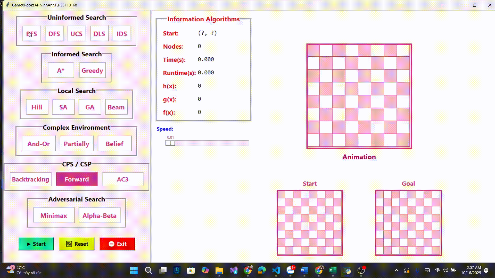
</p>

**Đánh giá:** Chính xác, tìm lời giải tối ưu nhưng **tốn bộ nhớ**.

#### **DFS**
<p align="center">
  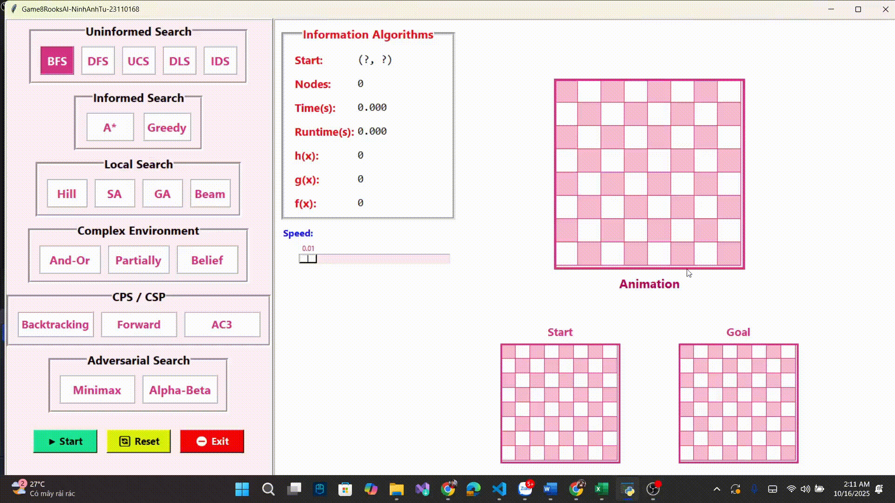
</p>

**Đánh giá:** Nhanh, nhưng **không đảm bảo tối ưu**, dễ rơi vào vòng lặp.

#### **UCS**
<p align="center">
  
</p>

**Đánh giá:** Tối ưu chi phí, nhưng **chậm hơn BFS** nếu chi phí đồng nhất.

#### **DLS**
<p align="center">
  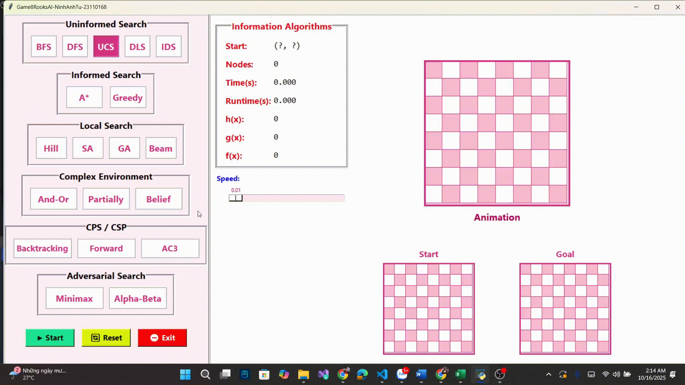
</p>

**Đánh giá:** Tránh vòng lặp vô hạn, nhưng **có thể bỏ lỡ lời giải**.

#### **IDS**
<p align="center">
  
</p>

**Đánh giá:** Cân bằng giữa BFS và DFS, **hiệu quả nhưng duyệt lặp lại nhiều**.

---

### 🔹 Nhóm Informed Search

#### **Greedy**
<p align="center">
  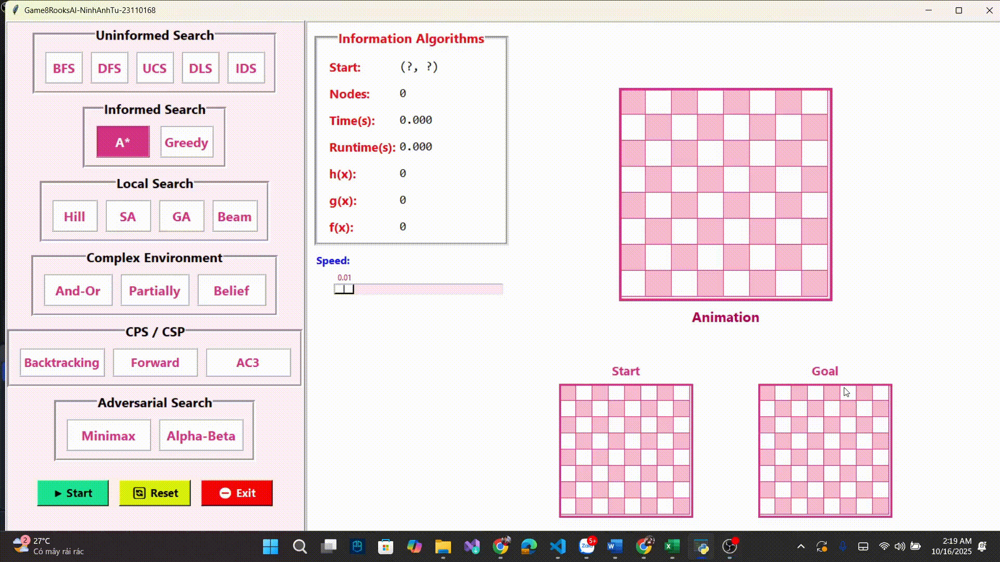
</p>

**Đánh giá:** **Rất nhanh**, nhưng dễ **mắc kẹt cực trị địa phương**.

#### **A\***
<p align="center">
  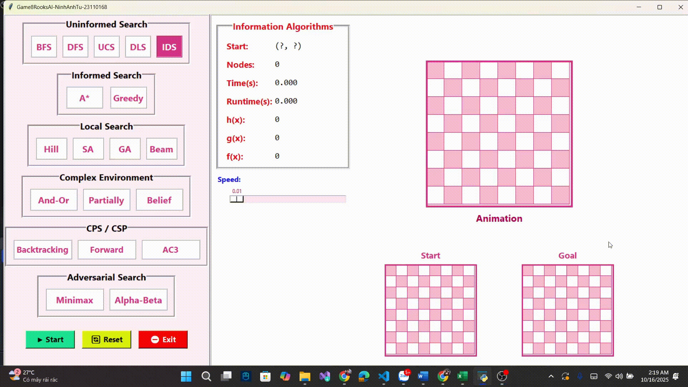
</p>

**Đánh giá:** **Tối ưu và hoàn chỉnh**, nhưng **tốn bộ nhớ và RAM**.

---

### 🔹 Nhóm Local Search

#### **Hill Climbing**
<p align="center">
  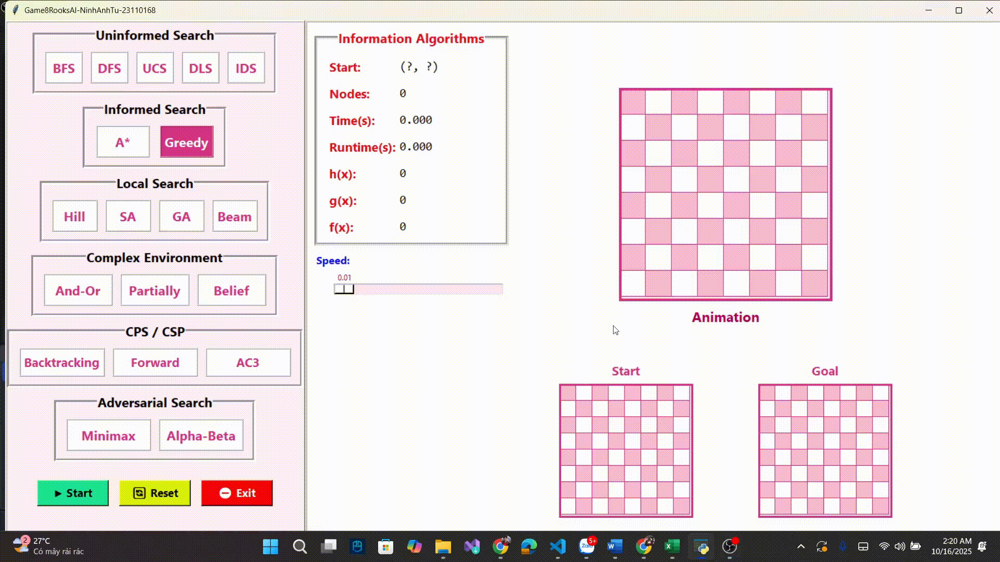
</p>

**Đánh giá:** Nhanh, đơn giản, nhưng **dễ mắc kẹt cực trị địa phương**.

#### **Simulated Annealing**
<p align="center">
  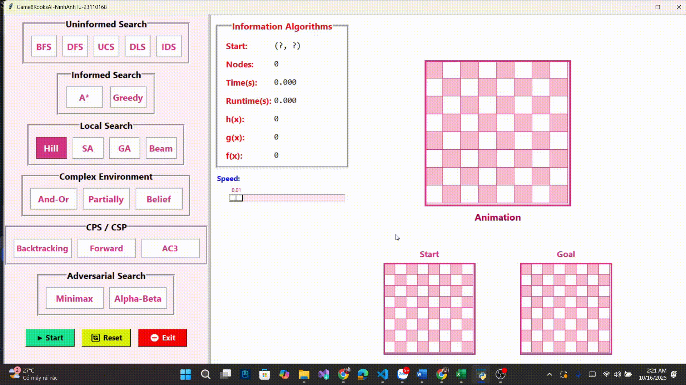
</p>

**Đánh giá:** Có khả năng **thoát cực trị địa phương**, nhưng **tốn thời gian duyệt**.

#### **Genetic Algorithm (GA)**
<p align="center">
  
</p>

**Đánh giá:** Tìm lời giải tốt trong không gian lớn, nhưng **phụ thuộc tham số**.

#### **Beam Search**
<p align="center">
  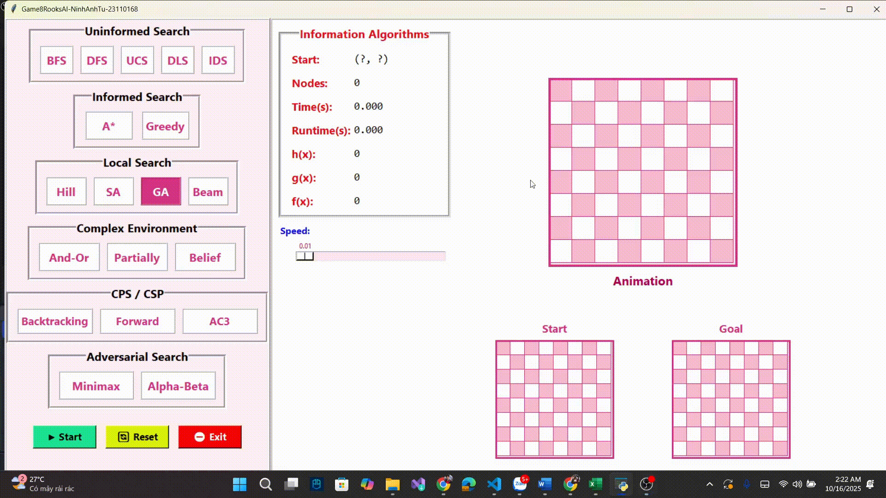
</p>

**Đánh giá:** **Giữ k nút tốt nhất mỗi mức**, tiết kiệm bộ nhớ nhưng **dễ bỏ lỡ lời giải tối ưu**.

---

### 🔹 Nhóm Complex Environment

#### **AND-OR Tree**
<p align="center">
  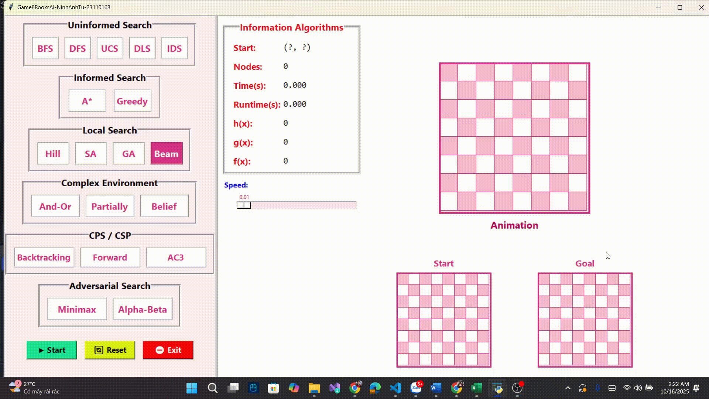
</p>

**Đánh giá:** Giải được bài toán **không chắc chắn**, nhưng **độ phức tạp cao**.

#### **Partially Observable**
<p align="center">
  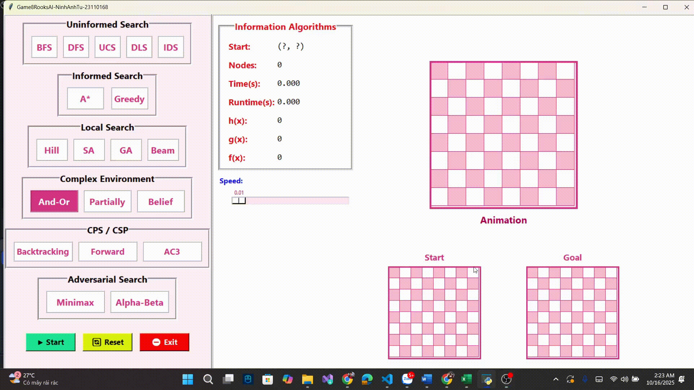
</p>

**Đánh giá:** Xử lý môi trường quan sát **một phần**, nhưng **bùng nổ tổ hợp**.

#### **Belief State**
<p align="center">
  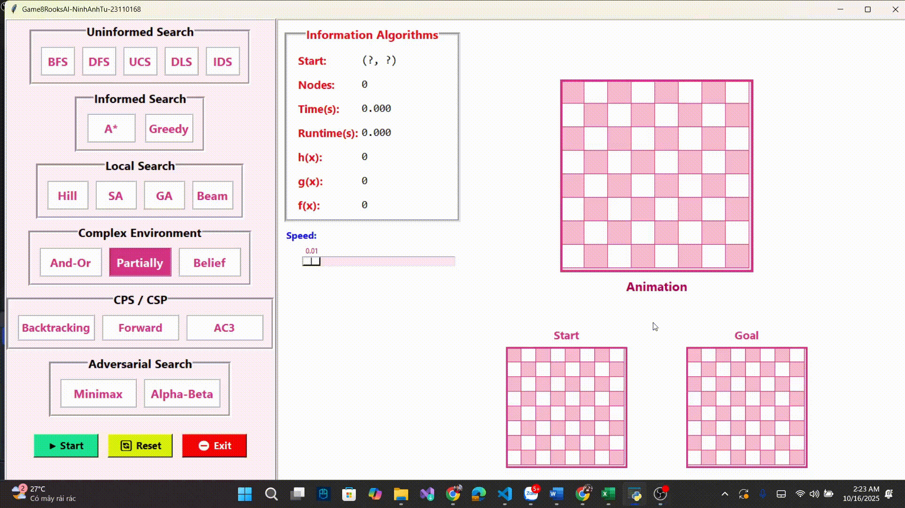
</p>

**Đánh giá:** **Giải tốt môi trường bất định**, nhưng **chi phí tính toán cao**.

---

### 🔹 Nhóm CSP (Constraint Satisfaction Problem)

#### **Backtracking**
<p align="center">
  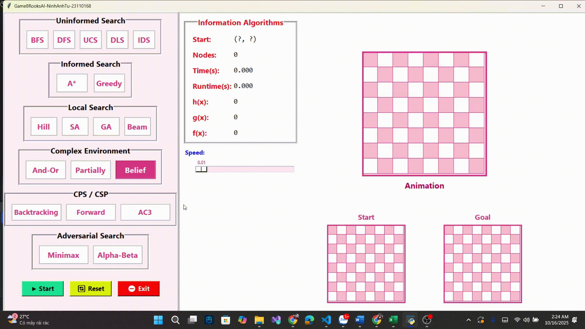
</p>

**Đánh giá:** **Đơn giản**, tiết kiệm bộ nhớ nhưng **chậm nếu ràng buộc lỏng**.

#### **Forward Checking**
<p align="center">
  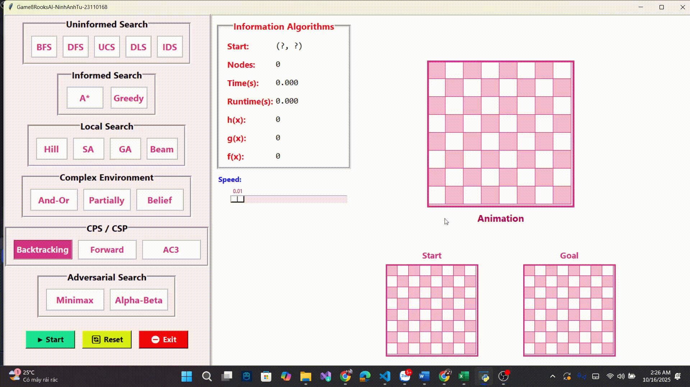
</p>

**Đánh giá:** Phát hiện **xung đột sớm**, nhưng **tốn chi phí duy trì miền**.

#### **AC3**
<p align="center">
  
</p>

**Đánh giá:** **Duy trì tính nhất quán cung**, giảm miền hiệu quả nhưng **tốn tính toán**.

---

### 🔹 Nhóm Adversarial Search

#### **Minimax**
<p align="center">
  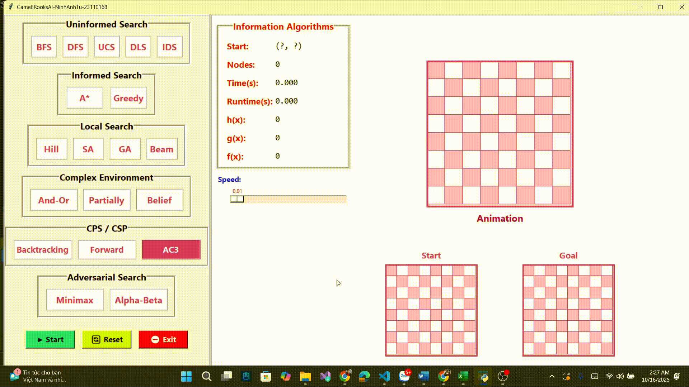
</p>

**Đánh giá:** **Tối ưu cho trò chơi đối kháng**, nhưng **rất tốn tài nguyên ở độ sâu lớn**.

#### **Alpha-Beta Pruning**
<p align="center">
  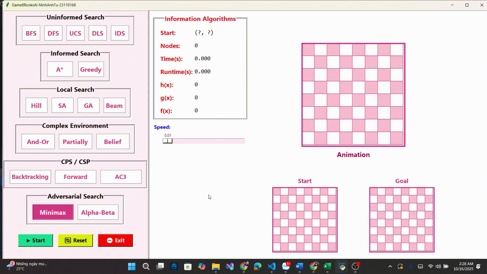
</p>

**Đánh giá:** **Cắt tỉa nhánh không cần thiết**, giảm đáng kể số nút duyệt so với Minimax.

---

### So sánh hiệu suất

#### Thời gian thực thi

<p align="center">
  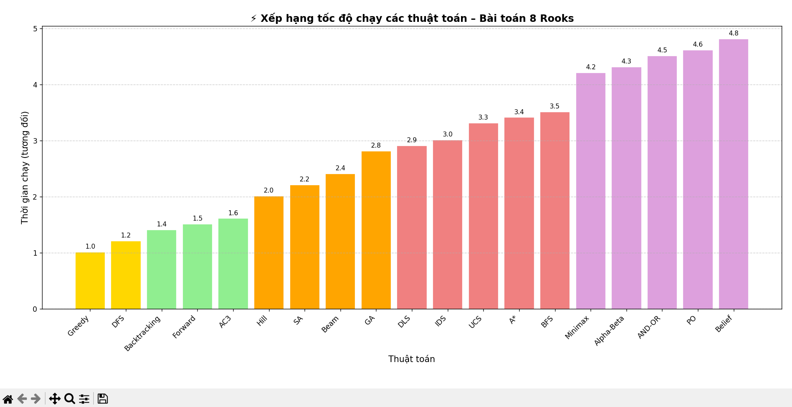
</p>

#### Số nodes đã duyệt

<p align="center">
  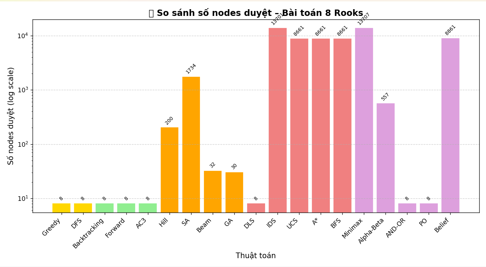
</p>

## Hướng dẫn sử dụng

### Yêu cầu hệ thống
- **Python:** 3.7+  
- **Thư viện:** `tkinter` (có sẵn trong Python)

### Cách chạy
```bash
git clone https://github.com/NinhAnhTu/Game8Rooks.git
cd Game8Rooks
python main.py

```

### Cấu trúc dự án
```bash
8RooksAI/
├── main.py             # File khởi chạy chính
├── gui.py              # Giao diện Tkinter
├── algorithms.py       # Chứa 19 thuật toán
└── assets/             # Ảnh quân cờ, icon

```

## Sử dụng giao diện

- Chọn **thuật toán** từ các nhóm bên trái (*Uninformed*, *Informed*, *Local*, *CSP*, *Adversarial*, ...).  
- Chọn **điểm bắt đầu** ở bàn cờ nhỏ (*Start*)
- Quan sát **bàn cờ ở giữa** để xem tiến trình hoạt động *step-by-step (animation)*.  
- Xem **bàn cờ nhỏ bên dưới** (Goal) để thấy kết quả cuối cùng sau khi thuật toán hoàn tất.  
- Theo dõi **bảng thông tin** hiển thị:
  - Điểm bắt đầu (Start(X,Y))
  - Thời gian python xử lý thuật toán (Time)
  - Thời gian thực tế hiển thị (RunTime)
  - Số nút mở rộng (Nodes)
  - Các giá trị `g(n)`, `h(n)`, `f(n)`, v.v.

---

### Mở rộng
- Bạn có thể **tua nhanh**, hoặc **chạy lại** để so sánh quá trình hoạt động giữa các thuật toán khác nhau.

---

## Hướng phát triển

### Mở rộng sang các bài toán khác
- *N-Queens*, *Sudoku*, *Knight's Tour*, ...

### Bổ sung thuật toán tiên tiến
- *Monte Carlo Tree Search (MCTS)*  
- *Q-learning*, *DQN*, ...

### Cải thiện giao diện
- Hiệu ứng animation mượt hơn  
- Hiển thị trực quan hơn

### Tính năng so sánh
- So sánh tự động giữa các thuật toán  
- Phân tích hiệu suất chi tiết

### Phát triển công cụ học tập
- Ứng dụng giảng dạy AI trực quan  
- Hỗ trợ sinh viên quan sát hoạt động của thuật toán

---

## Tài liệu tham khảo

- Russell, S., & Norvig, P. (2020). *Artificial Intelligence: A Modern Approach (4th ed.)*. Pearson.  
- Pearl, J. (1984). *Heuristics: Intelligent Search Strategies for Computer Problem Solving*. Addison-Wesley.  
- Mitchell, M. (1998). *An Introduction to Genetic Algorithms*. MIT Press.  
- Kumar, V. (1992). *Algorithms for Constraint Satisfaction Problems: A Survey*. *AI Magazine*.
- Russell, S., & Norvig, P. (2020). *Artificial Intelligence: A Modern Approach* (4th ed.). Pearson.  
- Python Software Foundation. (n.d.). *Tkinter — Python interface to Tcl/Tk*. Retrieved from https://docs.python.org/3/library/tkinter.html  
- Barr, A., & Feigenbaum, E. A. (1981). *The Handbook of Artificial Intelligence, Volume I*. William Kaufmann.  
- Norvig, P. (1992). *Paradigms of Artificial Intelligence Programming: Case Studies in Common Lisp*. Morgan Kaufmann.  